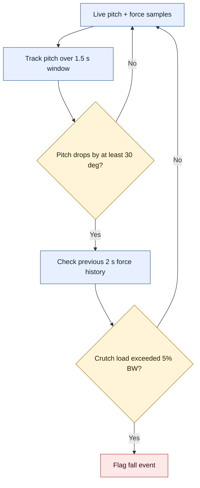

# Fall Detection Rule

```mermaid
flowchart TD
    A[Live pitch + force samples] --> B[Track pitch over 1.5 s window]
    B --> C{Pitch drops by at least 30 deg?}
    C -- No --> A
    C -- Yes --> D[Check previous 2 s force history]
    D --> E{Crutch load exceeded 5% BW?}
    E -- No --> A
    E -- Yes --> F[Flag fall event]

    classDef process fill:#e8f1ff,stroke:#2f5f9f,color:#0f1f33;
    classDef decision fill:#fff4d6,stroke:#b7791f,color:#2d1b00;
    classDef alert fill:#fde8e8,stroke:#c53030,color:#3b0a0a;

    class A,B,D process;
    class C,E decision;
    class F alert;
```
