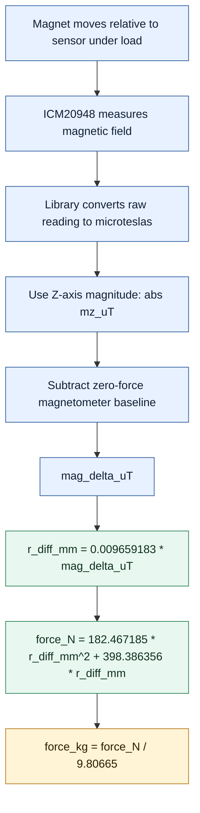

# Magnetometer-Based Force Sensing

```mermaid
flowchart TD
    A[Magnet moves relative to sensor under load] --> B[ICM20948 measures magnetic field]
    B --> C[Library converts raw reading to microteslas]
    C --> D[Use Z-axis magnitude: abs mz_uT]
    D --> E[Subtract zero-force magnetometer baseline]
    E --> F[mag_delta_uT]
    F --> G[r_diff_mm = 0.009659183 * mag_delta_uT]
    G --> H[force_N = 182.467185 * r_diff_mm^2 + 398.386356 * r_diff_mm]
    H --> I[force_kg = force_N / 9.80665]

    classDef process fill:#e8f1ff,stroke:#2f5f9f,color:#0f1f33;
    classDef calibration fill:#e8f7ef,stroke:#2f855a,color:#0f2f1f;
    classDef output fill:#fff4d6,stroke:#b7791f,color:#2d1b00;

    class A,B,C,D,E,F process;
    class G,H calibration;
    class I output;
```
