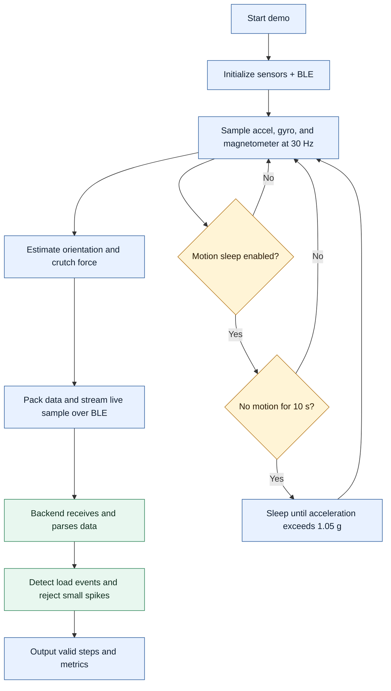

# Current Demo Firmware Flow

```mermaid
flowchart TD
    A[Start demo] --> B[Initialize sensors + BLE]
    B --> C[Sample accel, gyro, and magnetometer at 30 Hz]
    C --> D[Estimate orientation and crutch force]
    D --> E[Pack data and stream live sample over BLE]
    E --> F[Backend receives and parses data]
    F --> G[Detect load events and reject small spikes]
    G --> H[Output valid steps and metrics]

    C --> I{Motion sleep enabled?}
    I -- No --> C
    I -- Yes --> J{No motion for 10 s?}
    J -- No --> C
    J -- Yes --> K[Sleep until acceleration exceeds 1.05 g]
    K --> C

    classDef process fill:#e8f1ff,stroke:#2f5f9f,color:#0f1f33;
    classDef decision fill:#fff4d6,stroke:#b7791f,color:#2d1b00;
    classDef backend fill:#e8f7ef,stroke:#2f855a,color:#0f2f1f;

    class A,B,C,D,E,H,K process;
    class I,J decision;
    class F,G backend;
```
