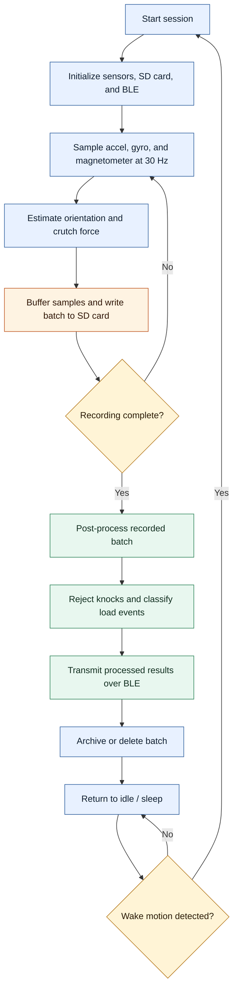

# Intended Final Product: SD Card + BLE Software Flow

```mermaid
flowchart TD
    A[Start session] --> B[Initialize sensors, SD card, and BLE]
    B --> C[Sample accel, gyro, and magnetometer at 30 Hz]
    C --> D[Estimate orientation and crutch force]
    D --> E[Buffer samples and write batch to SD card]
    E --> F{Recording complete?}
    F -- No --> C
    F -- Yes --> G[Post-process recorded batch]
    G --> H[Reject knocks and classify load events]
    H --> I[Transmit processed results over BLE]
    I --> J[Archive or delete batch]
    J --> K[Return to idle / sleep]
    K --> L{Wake motion detected?}
    L -- No --> K
    L -- Yes --> A

    classDef process fill:#e8f1ff,stroke:#2f5f9f,color:#0f1f33;
    classDef decision fill:#fff4d6,stroke:#b7791f,color:#2d1b00;
    classDef backend fill:#e8f7ef,stroke:#2f855a,color:#0f2f1f;
    classDef storage fill:#fef3e2,stroke:#c05621,color:#321500;

    class A,B,C,D,J,K process;
    class F,L decision;
    class E storage;
    class G,H,I backend;
```
