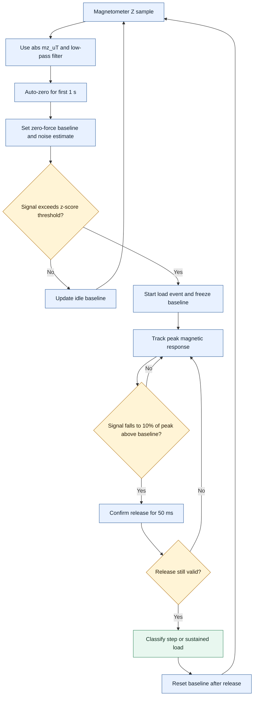

# Auto-Zeroing + Step Event Detection

```mermaid
flowchart TD
    A[Magnetometer Z sample] --> B[Use abs mz_uT and low-pass filter]
    B --> C[Auto-zero for first 1 s]
    C --> D[Set zero-force baseline and noise estimate]
    D --> E{Signal exceeds z-score threshold?}
    E -- No --> F[Update idle baseline]
    F --> A
    E -- Yes --> G[Start load event and freeze baseline]
    G --> H[Track peak magnetic response]
    H --> I{Signal falls to 10% of peak above baseline?}
    I -- No --> H
    I -- Yes --> J[Confirm release for 50 ms]
    J --> K{Release still valid?}
    K -- No --> H
    K -- Yes --> L[Classify step or sustained load]
    L --> M[Reset baseline after release]
    M --> A

    classDef process fill:#e8f1ff,stroke:#2f5f9f,color:#0f1f33;
    classDef decision fill:#fff4d6,stroke:#b7791f,color:#2d1b00;
    classDef event fill:#e8f7ef,stroke:#2f855a,color:#0f2f1f;

    class A,B,C,D,F,G,H,J,M process;
    class E,I,K decision;
    class L event;
```
